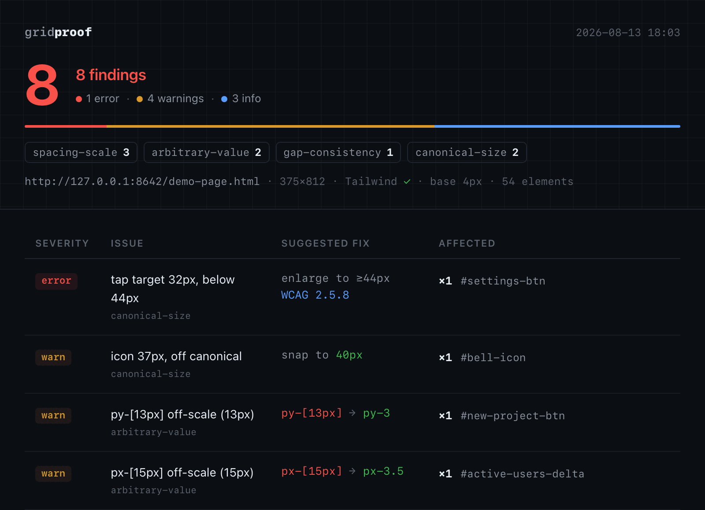

# Gridproof

[](https://www.npmjs.com/package/gridproof)
[](./LICENSE)

**Gridproof your UI — automated spacing & grid QA in the agent loop.**

Gridproof is an [MCP](https://modelcontextprotocol.io) server that renders your
running frontend with Playwright, measures the **computed** geometry of every
element, checks it against a spacing/token rule set, and hands back a
structured fix report — so a coding agent can close the loop itself: generate,
audit, fix, re-audit.


<!-- SCREENSHOT: HTML report — findings state. Replace docs/report-screenshot.png before launch. -->

## The problem

AI coding agents are good at generating UI and bad at keeping it on a grid:
`py-[13px]` instead of `py-3`, sibling cards with three different gaps,
icons at 17px next to icons at 24px. None of it breaks anything, so it ships —
because nothing in the agent loop checks for it. Gridproof is that check.

## The loop

```text
agent generates UI → gp_audit(url) → JSON violations with fix hints
→ agent edits source → gp_audit(url) → clean report = done
```

The server never touches your source files. It measures a rendered page and
points; the agent (which has your codebase open) makes the edit.

## Quickstart

```bash
# One-time: install the Chromium build Playwright uses (~150MB)
npx playwright install chromium
```

### Register in Claude Code

```bash
claude mcp add gridproof -- npx -y gridproof
```

From a local checkout:

```bash
npm install && npm run build
claude mcp add gridproof -- node /absolute/path/to/gridproof/dist/index.js
```

### Three ways to use it

**1. `gp_audit` — inside the agent loop.** The agent calls this MCP tool
directly against your running dev server and gets back structured JSON
(violations + fix hints) to act on.

**2. `gp_report` — MCP tool that also writes an HTML report.** Same inputs as
`gp_audit`, plus it writes a self-contained, shareable HTML file to disk.

**3. `npx gridproof --report <url>` — one-shot CLI.** No MCP client needed;
useful for a quick manual check or scripting.

```bash
npx gridproof --report http://localhost:5173
# writes ./gridproof-report.html, prints its path

npx gridproof --report http://localhost:5173 --out ./qa/report.html --viewport 375x812
```

## The rules

Four rules. All report `warn` by default — nothing blocks, nothing has
exit-code semantics. **Suggest, don't forbid**; the one exception is tap
targets, which error because it's an accessibility floor, not a style opinion.

| Rule | Detects | Severity | Example fix |
|------|---------|----------|-------------|
| `spacing-scale` | Computed margin/padding/gap that isn't a multiple of the base unit (default 4px) and isn't an allowed value | warn | Snaps to the nearest valid value |
| `arbitrary-value` | Off-scale arbitrary Tailwind classes | warn | `py-[13px]` → `py-3` |
| `gap-consistency` | Siblings in a flex/grid container spaced inconsistently when `gap` isn't set | warn | Set `gap-4` on the container instead of per-child margins |
| `canonical-size` | Icon/interactive-element sizes off the canonical scale, and interactive elements below the tap-target minimum | warn (icons) / **error** (tap targets) | Snap to canonical size; [WCAG 2.5.8](https://www.w3.org/WAI/WCAG21/Understanding/target-size-minimum.html) |

## Tailwind, and non-Tailwind pages

Gridproof is built for Tailwind projects — that's where all four rules apply,
since `spacing-scale`, `arbitrary-value`, and `gap-consistency` reason about
Tailwind's spacing scale and utility classes.

On a page it doesn't detect as Tailwind, it auto-falls-back to
accessibility-only checks: `canonical-size` still runs (tap targets, icon
sizes), the three Tailwind-specific rules are skipped, and the report says so
explicitly rather than silently under-reporting. You can force this with
`assumeTailwind: false` in config.

## Configuration

Optional `gridproof.config.json` at your project root (all fields optional;
defaults shown):

```json
{
  "baseUnit": 4,
  "allowedValues": [1, 2],
  "canonicalSizes": [12, 14, 16, 20, 24, 32, 40, 48],
  "minTapTarget": 44,
  "tapTargetBreakpoint": 768,
  "iconTolerance": 2,
  "assumeTailwind": "auto",
  "rules": {
    "spacing-scale": "warn",
    "arbitrary-value": "warn",
    "gap-consistency": "warn",
    "canonical-size": "error"
  },
  "suppress": [
    { "selector": ".hero-art *", "rules": ["spacing-scale"] },
    { "value": "13px", "reason": "optical correction, logo lockup" }
  ]
}
```

Inline suppression: `data-gp-ignore` (all rules) or
`data-gp-ignore="spacing-scale gap-consistency"` on any element skips its
subtree for those rules. Suppressed findings are counted, never listed.

## What it deliberately does NOT do

- **No computer vision / screenshot analysis.** It reads computed geometry,
  not pixels. A screenshot is attached to the HTML report, not analyzed.
- **No CI runner.** It's an in-loop tool for an agent, not a merge gate — no
  exit codes, nothing fails a build.
- **No source editing.** The server measures and suggests; the agent (which
  has your codebase) makes the edits.
- **No auth, no SaaS, no billing.** It's a local MCP server and a CLI.
- **Not yet (v2 candidates, not implemented):** column-grid clustering,
  cross-breakpoint alignment drift, Figma token import.

## How it works

Playwright renders the target page headless, a single in-page script walks the
DOM and collects computed geometry (margins, padding, gap, rects), and the
rule engine checks each value against your config and emits violations with
selectors, actual/expected values, and fix hints. It's tuned against roughly
60 real-world sites to keep false positives low — a subpixel rounding
tolerance, an allowed-values list, and severity defaults all come out of that
calibration, not guesswork.

## Development

```bash
npm install
npm run build   # tsc → dist/
npm test        # vitest (unit + Playwright integration)
npm run dev     # run the server from TypeScript (tsx)
```

## License

MIT — v0.1.0
